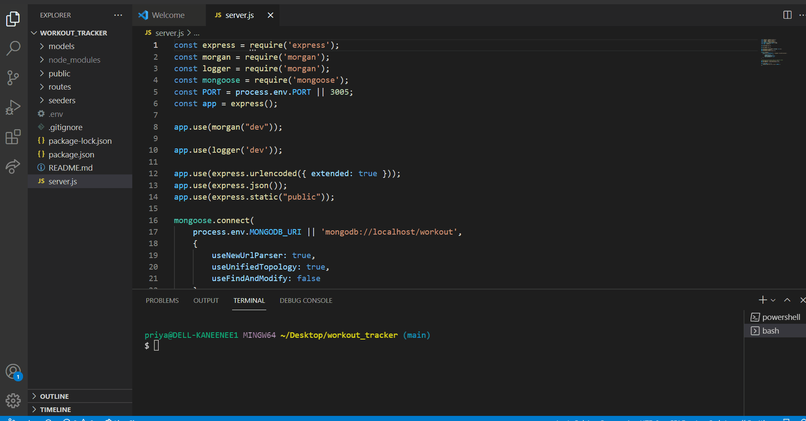
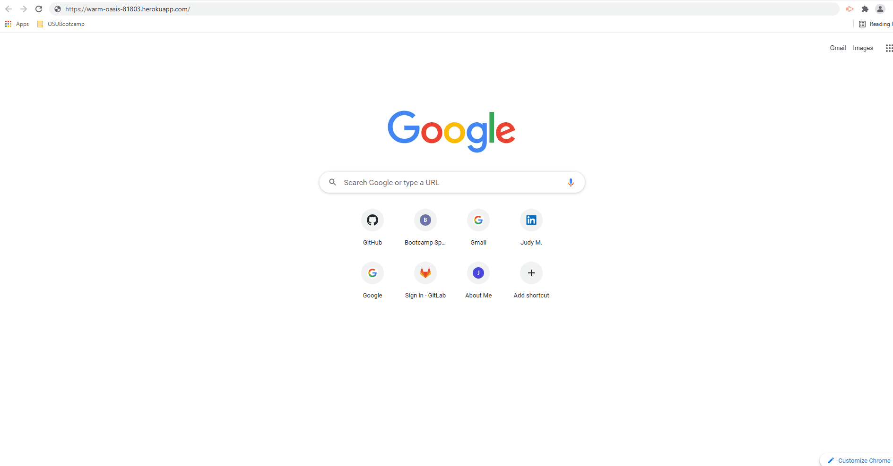
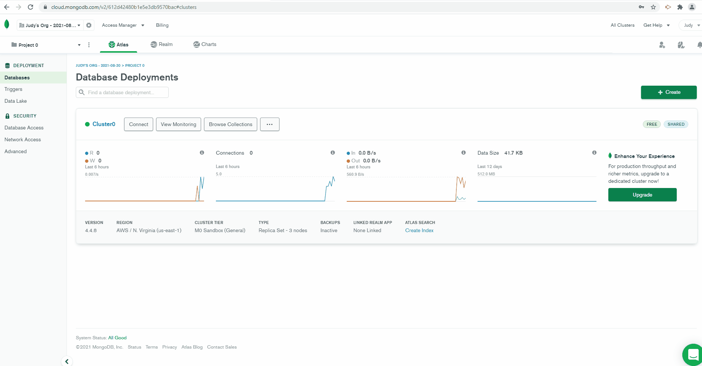

# workout_tracker
This application  asks input for the Cardio and Resistance Activities-then displays the consolidated statistics like- workout duration ,distance covered(cardio) ,weights /sets/reps (resistance),no of exercises etc.
The dashboard represents a Graphical intepretation
* Thanks to my tutor Alexis San Javier who helped me with his review on the HW -routes ,Collections at Atlas  MongoDB and on Robo3T and working of the working of the app on Heroku
* Deployed Github link  https://github.com/JudyMotha/workout_tracker
* Heroku   https://warm-oasis-81803.herokuapp.com/

Find below the GIF file for app on local host ,Heroku ;GIF for AtlasMongo Collections also provided below

Local host
Heroku  
AtlasMongo Collections 
